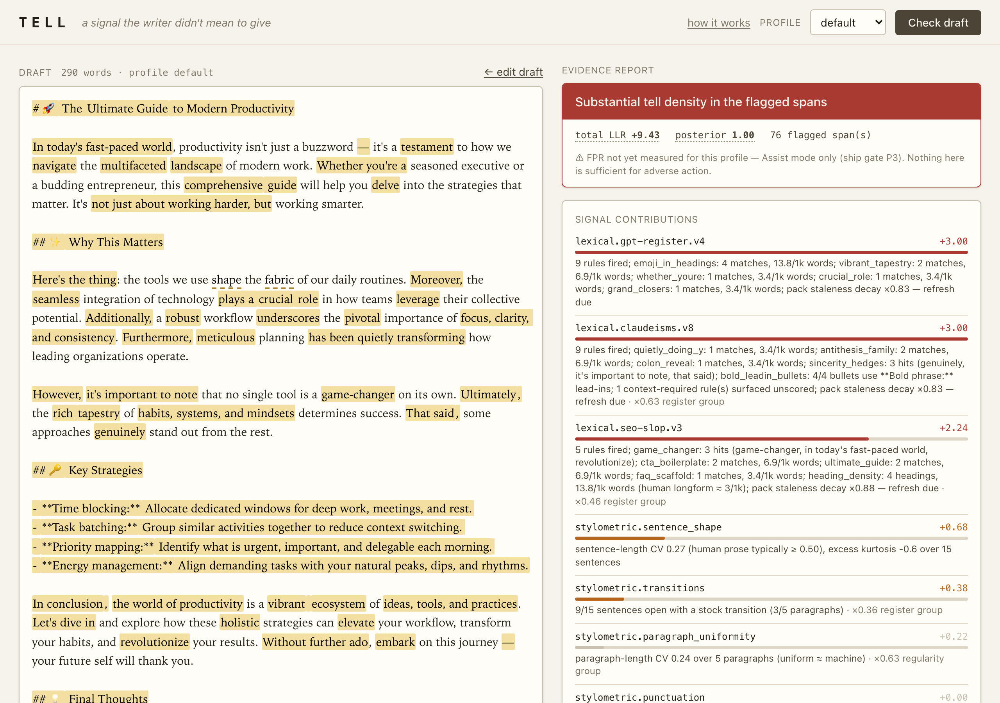
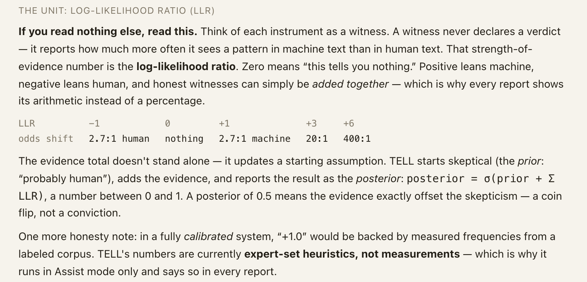

# tell-packs

The rule packs from [TELL, an AI-Text Detector That Shows Its Work](https://davidder.com/tell-ai-text-detector.html).

TELL is a detection engine that returns evidence instead of a verdict. Most
of it is statistics: perplexity, the Binoculars ratio, sentence-length
distributions. This repo is the other part, the hand-written one. Four YAML
files of lexical and structural tells, the phrases and habits that show up
far more often in generated prose than in prose a person sat down and wrote.

The engine's source stays private for now, but its design does not.
`rebuild/` is a specification pack detailed enough for Claude Code or a
similar assistant to rebuild the whole engine: segmenter, the signal
contract, the stylometric and statistical signals, the pack loader with
its scoring and decay rules, fusion, the report, the CLI, and the web UI,
with the test suite spelled out as requirements. See the kickoff prompt at
the end of `rebuild/README.md`.



*The paste UI on a deliberately awful sample. Every highlight is a span some
instrument flagged, and the right column is the arithmetic.*

The packs alone are not the whole detector. They are the S4 lexical layer.
The statistical layer (perplexity, Binoculars, burstiness) and the
stylometric layer (sentence shape, paragraph uniformity, punctuation,
diversity, transitions) are code, and `rebuild/12_SPEC_STYLOMETRIC.md`
and `rebuild/13_SPEC_STATISTICAL.md` carry their formulas and thresholds
verbatim.

## The packs

| file | what it catches | rules | half-life |
|---|---|---|---|
| `packs/claudeisms.yaml` | Claude-leaning habits: em-dash rate, the antithesis family ("not X but Y"), bold lead-in bullets, tricolons, "quietly" metaphors, two-word fragments for punch | 19 | 120 days |
| `packs/gpt-register.yaml` | The 2023 GPT vocabulary (delve, tapestry, testament, pivotal, robust, seamless), emoji in headings, paragraph-head "Furthermore", "whether you're a" | 14 | 120 days |
| `packs/chatbot-voice.yaml` | A chat transcript pasted into a document: "Great question", "I hope this helps", "Let me know if you'd like" | 3 | 240 days |
| `packs/seo-slop.yaml` | Generated article scaffolding: "ultimate guide", "let's dive in", FAQ and Key Takeaways headings, heading density | 6 | 180 days |

Each pack has a `version`, an `updated` date, and a `half_life_days`, because
tells decay: providers retrain, writers learn, and a phrase that was a
near-certain marker in 2023 is a period detail by 2026. The engine halves a pack's weight
every half-life past its `updated` date and says so in the report. If you
consume these files, do something similar, or at least look at the dates.

## One rule is noise

Every rule in these packs fires in writing by people. Real humans use em-dashes.
Real humans write "ultimate guide". The only thing worth measuring is density
of co-occurrence across independent rules, and TELL enforces it two ways:

- A pack's total score is scaled down hard when few distinct rules fire.
  One rule firing keeps 35% of its weight, two keep 65%, three keep 85%.
- Fusion caps the contribution of any single signal, so a pack can never
  carry a report on its own.

If you port these rules into your own tool and skip that step, you will
build a thing that accuses people who like dashes.


*The terminal report on a 115,000-word document, technical profile. The
Claude-isms pack fired at +3.00 and the total still stopped one hundredth
of a point under elevated. That is the single-fire ceiling doing its job.*

## The unit

Every rule's `weight` is a multiplier on a log-likelihood ratio in
natural-log units. Zero means the observation is equally likely under
either hypothesis. Plus one is about 2.7 to 1 toward machine, plus three
is 20 to 1, plus six is 400 to 1. Honest signals in this unit can be added.



## Rule format

```yaml
pack: seo-slop          # pack name, shown in the report
version: 3              # bump on any rule change
half_life_days: 180     # weight halves every N days past `updated`
updated: 2026-09-02     # ISO date of last rule change
scope: [prose, longform, blog]
rules:
  - id: game_changer
    type: lexicon       # lexicon | regex | rate | structural
    terms: [game-changer, revolutionize, cutting-edge, supercharge]
    note: 'optional, shown next to the hit'
    weight: 1.2         # multiplier on the rule's log-likelihood ratio
```

Four rule types, in order of cost:

- `lexicon`: a list of `terms`, matched case-insensitively as whole words or
  phrases. Scored by hits per 1,000 words against a human baseline.
- `regex`: a `pattern`, scored the same way. Python `re` syntax, with
  `\p{Emoji}` expanded to an explicit class before compiling.
- `rate`: a `pattern` with an explicit `baseline: {human_p50, human_p95}`
  in hits per 1,000 words. Use this when you have real numbers for the
  human distribution rather than the type defaults.
- `structural`: a named `detect` function over the parsed document, with an
  optional `threshold`. The detectors shipped in TELL are
  `bullet_starts_with_bold_phrase_then_colon_or_dash`, `tricolon_density`,
  `anaphora_triple`, `fragment_punch`, `uniform_bullet_length`, and
  `heading_density`. Their implementations are not in this repo. The
  `note` on each rule says what the detector looks for, so you can write
  your own.

Density rules score zero below the human median, ramp to the full `weight`
at the human 95th percentile, and reach 1.5x weight at twice the 95th
percentile. The defaults when a rule gives no `baseline`:

| type | human p50 | human p95 |
|---|---|---|
| lexicon | 0.5 | 3.0 |
| regex | 0.2 | 2.0 |
| rate | 0.5 | 3.0 |

A rule marked `context_required: true` is surfaced but never scored without
a judge that can read the surrounding text. One shipped rule uses it:
`metaphor_vocabulary` in `claudeisms.yaml`, because a literal spine is
innocent and the engine does not guess.

## Rebuilding the engine

```
git clone https://github.com/david-der/tell-packs my-tell && cd my-tell
cp rebuild/CLAUDE.md .
claude
```

Then paste the kickoff prompt from `rebuild/README.md`. The pack is
written so the build can proceed one story at a time from
`rebuild/30_BUILD_PLAN.md`, with the 58 tests of the reference build
described in each spec's test mapping. Everything in the pack is MIT
licensed like the packs.

## Contributing

Pull requests for new tells are welcome, with two conditions:

1. Say where you saw it. A rule needs at least a note explaining what
   construction it targets and, ideally, why it is rare in human writing.
2. Bump `version` and set `updated` on the pack you touched.

Rules that only fire on one provider's output belong in that provider's
pack. Shared structural habits go in `claudeisms.yaml` for now, which is a
naming accident I will fix when it earns a file of its own.

## License

MIT, see [LICENSE](LICENSE).
