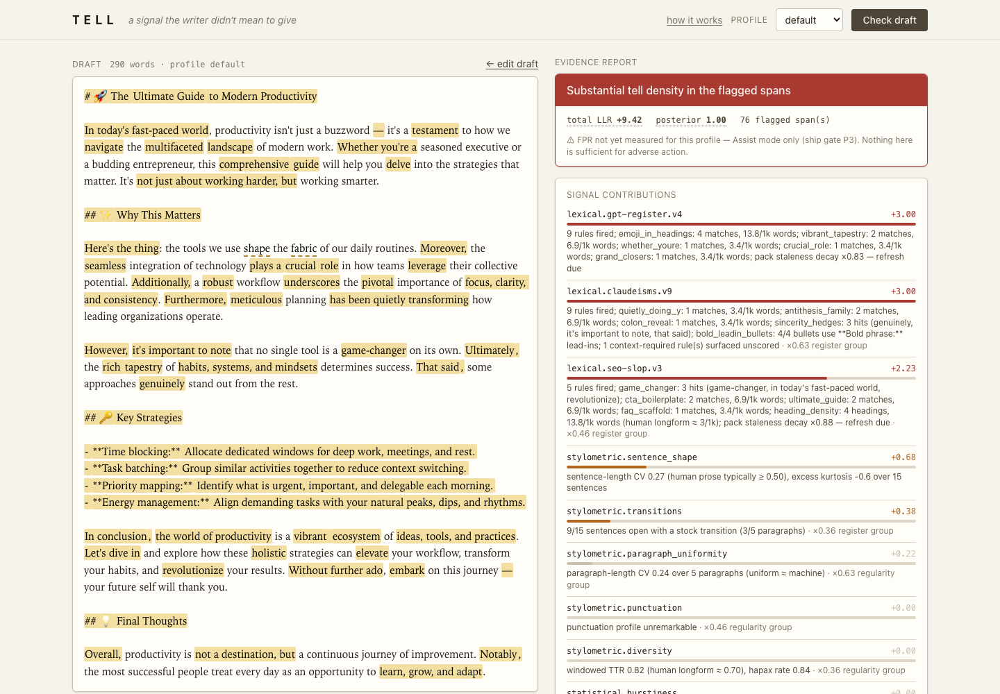

# 10 · PRD — TELL Assist mode with optional statistical signals

## 1. Claims to prove

The rebuilt product proves these claims, each by a test or a demo step
named in §6.

1. **Evidence, not verdicts.** Every output is a list of signal
   contributions with spans and rationales, a band, a stated unmeasured
   false-positive rate, and a "what would change this" block. No output
   anywhere is a bare percentage or a pass/fail.
2. **A lone tell cannot condemn a document.** A single signal, however
   strong, cannot push the total past 2.9, and a pack where one rule fired
   keeps 35% of its weight.
3. **The ordering holds on the fixtures.** `seed/ai_slop.md` scores at
   least 2.0 LLR above `seed/human_essay.txt` under the default profile,
   lands in `elevated` or `substantial`, and the essay lands in `none` or
   `mild`.
4. **Profiles change the answer.** The same text scores lower under
   `technical` than `default` when the only differences are the dampened
   features.
5. **Packs decay and validate.** A pack dated long ago loads with reduced
   weight and a stale marker; a malformed pack raises a `PackError` naming
   the file and rule.
6. **The statistical arm is optional and honest.** With no models present,
   the three S2 signals appear under `skipped` with a reason and nothing
   else changes. With models present, instruct-generated text reads
   machine on Binoculars and the human fixture reads neutral.
7. **The web UI is the same report.** `POST /api/check` returns the JSON
   report; the page highlights every span at the right characters,
   including text containing emoji and other astral code points.



## 2. Users and scope

One user: a writer or editor asking "does my draft read like a machine
wrote it, and where?" Mode: Assist. Inputs: Markdown or plain text up to
200,000 bytes through the web UI, any size through the CLI. Output: the
evidence report in the terminal, as JSON, or in the browser.

Out of scope is listed in `00_PROGRAM.md` §5.

## 3. Stack (reference, not mandate)

| Layer | Reference choice | Version pin |
|---|---|---|
| Language | Python | ≥ 3.11 |
| Packaging | `uv`, `pyproject.toml`, hatchling, `src/tell` layout | |
| Packs | PyYAML | ≥ 6.0 |
| Terminal | Rich | ≥ 13.7 |
| Web | FastAPI, Uvicorn, Jinja2 | ≥ 0.115, ≥ 0.30, ≥ 3.1 |
| CSS | Tailwind standalone CLI binary, output committed | |
| S2 (optional group `statistical`) | llama-cpp-python, numpy | ≥ 0.3, ≥ 1.26 |
| Dev | pytest ≥ 8.0, ruff ≥ 0.6 (line length 100, rules E F I UP B, ignore E501), httpx ≥ 0.27, Playwright ≥ 1.45 | |
| Task runner | `just` | |

Console script: `tell = "tell.cli:main"`. Package version string `0.1.0`.

Task runner recipes the rebuild must provide, with the same names:
`setup`, `test`, `lint`, `fix`, `dev [file]`, `packs`, `setup-statistical`,
`models`, `css`, `css-watch`, `web`, `screenshot [label]`.

## 4. Repository layout (reference)

```
tell/
├─ pyproject.toml
├─ justfile
├─ README.md
├─ CLAUDE.md                 copied from rebuild/CLAUDE.md
├─ packs/                    the four YAML packs, unchanged
├─ examples/sample-draft.md  from rebuild/seed/
├─ models/                   gitignored; GGUF pair lands here via `just models`
├─ scripts/screenshot.py     Playwright capture of the five web states
├─ src/tell/
│  ├─ __init__.py            __version__
│  ├─ types.py               Cost, Span, SignalResult, Sentence, Paragraph, Document, Profile, Signal, ramp
│  ├─ segmenter.py           normalize, segment, split_sentences
│  ├─ profiles.py            PROFILES, get_profile
│  ├─ engine.py              build_signals, run_signals, check, DEFAULT_PACKS_DIR
│  ├─ fusion.py              fuse, BANDS, CAP_SINGLE_SIGNAL, SINGLE_FIRE_CEILING
│  ├─ report.py              report_dict, render_json, render_terminal, FPR_LINE
│  ├─ cli.py                 main
│  ├─ signals/
│  │  ├─ __init__.py
│  │  ├─ stylometric.py      STYLOMETRIC_SIGNALS
│  │  ├─ statistical.py      statistical_signals, LlamaBackend, statistical_status
│  │  └─ rulepacks.py        load_pack, load_packs, RulePackSignal, PackError
│  └─ web/
│     ├─ __init__.py         app
│     ├─ templates/index.html
│     └─ static/{src/input.css, css/tailwind.css, js/app.js}
└─ tests/
   ├─ conftest.py            no_real_models autouse fixture; ai_text, human_text, packs_dir
   ├─ fixtures/{ai_slop.md, human_essay.txt}
   └─ test_{segmenter,stylometric,statistical,rulepacks,fusion,cli,web}.py
```

## 5. Definition of done

- All 58 tests in §7 pass with `just test`, with no model weights on disk,
  in under five seconds.
- `just lint` is clean.
- `uv run tell check examples/sample-draft.md` renders the terminal report
  and exits 0. `--json` renders the JSON report. `tell packs` lists four
  packs. `tell profiles` lists three.
- `just web` serves the page on port 8001; `just screenshot` produces the
  five PNGs named in spec 16.
- With `just setup-statistical` and `just models` done, the same check shows
  three `statistical.*` contributions instead of three skips.
- Every requirement ID in specs 11 through 16 maps to a story in
  `30_BUILD_PLAN.md`.

## 6. Demo script

Run from the repository root after the build is done. Each step names the
claim it proves.

1. `uv run tell check examples/sample-draft.md` → band `elevated` or
   `substantial`, a contributions table with `lexical.seo-slop.v3` and
   `lexical.gpt-register.v4` near the top, a spans table, the FPR line, the
   "What would change this" panel, exit code 0. Claim 1, 3.
2. `uv run tell check tests/fixtures/human_essay.txt` → band `none` or
   `mild`, exit code 0. Claim 3.
3. `uv run tell check examples/sample-draft.md --profile technical --json | jq .assessment` → `total_llr` lower than step 1's. Claim 4.
4. `uv run tell packs` → four lines, no `stale` marker. Edit a copy of a
   pack to `updated: 2024-01-01`, point `--packs` at it → `stale ×0.25`.
   Claim 5.
5. `printf 'pack: x\nrules:\n  - id: a\n    type: regex\n' > /tmp/bad.yaml; uv run tell packs --packs /tmp` → `tell: /tmp/bad.yaml: rule 'a' (regex) requires 'pattern'`, exit 2. Claim 5.
6. `uv run tell check examples/sample-draft.md --json | jq .skipped` with
   no models → three `statistical.*` entries with a reason. Claim 6.
7. `just models`, repeat step 6 → `skipped` is empty and three
   `statistical.*` contributions appear. Claim 6.
8. `just web`, open the page, paste `examples/sample-draft.md`, check →
   highlights and report match Fig 02. Paste a line containing an emoji
   before a flagged phrase; the highlight still lands on the phrase.
   Claim 7.

## 7. Requirements summary

The specs define the requirements. Counts by prefix, for planning:

| Spec | Prefixes | Tests held to account |
|---|---|---|
| 11 | CORE, SEG, PROF | test_segmenter (6) |
| 12 | STY | test_stylometric (5) |
| 13 | STAT | test_statistical (9) |
| 14 | PACK | test_rulepacks (14) |
| 15 | FUS, REP, CLI | test_fusion (7), test_cli (7) |
| 16 | WEB | test_web (10) |

Total: 58 tests. Source: `pytest -q` on the reference build, 2026-10-05.

## 8. Milestones

See `30_BUILD_PLAN.md`. Stop points: after M1 (core and segmenter green),
after M4 (engine end to end through the CLI), and at the end.

## 9. Guardrails

The ten rules in `00_PROGRAM.md` §3. The receiving `CLAUDE.md` repeats
them.
