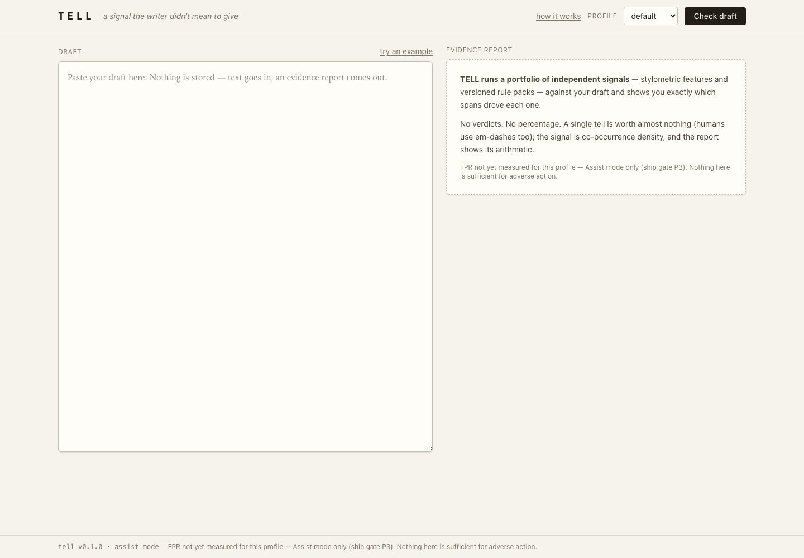
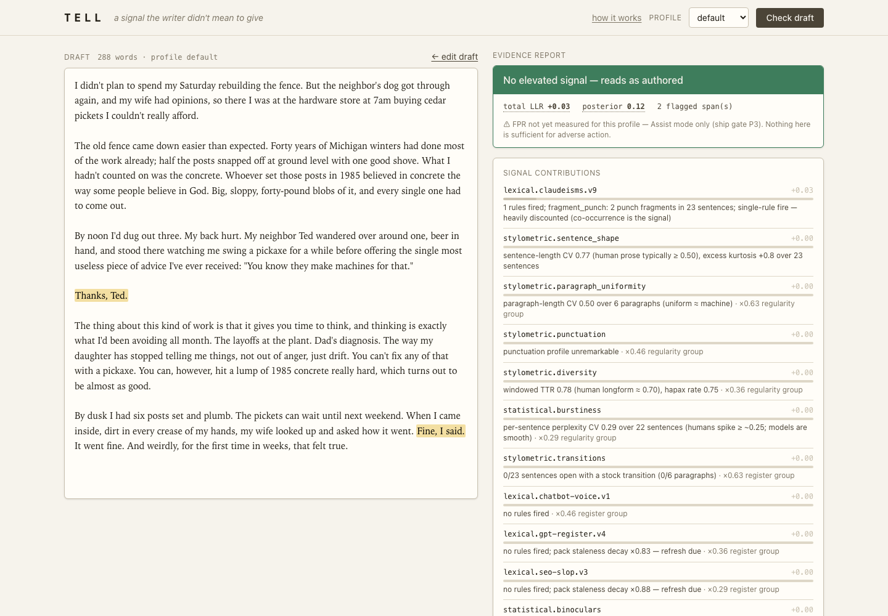
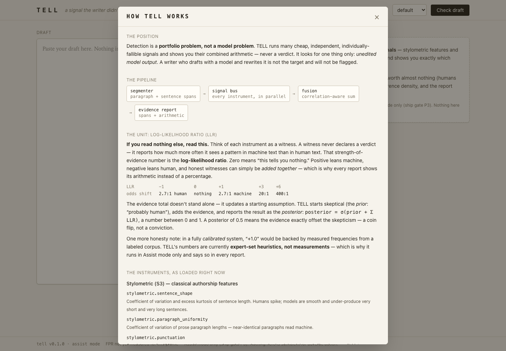
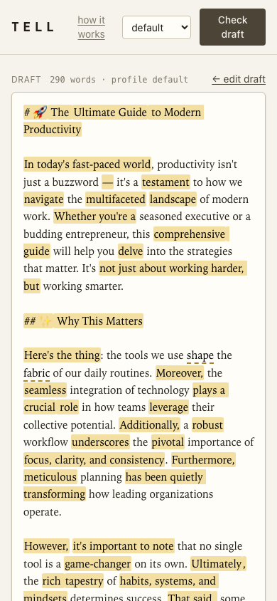

# 16 · Web paste UI and JSON API

**Purpose.** The browser surface for Assist mode: paste a draft, pick a
profile, read the evidence report with every flagged span highlighted in
place. It is the terminal report of `15_SPEC_FUSION_REPORT_CLI.md` rendered
as HTML, plus a self-documenting "How it works" page generated from the
running engine so the documentation cannot drift from the code.

**Marker.** Sections headed [NORMATIVE] are requirements; [GUIDANCE]
explains why. **Requirement prefix:** `WEB`. **Tests that hold this spec to
account:** `tests/test_web.py` (10 tests, listed in §12). **Depends on:**
`11_SPEC_CORE.md` (profiles, `check()`), `14_SPEC_RULEPACKS.md` (pack
metadata shown in the roster), `13_SPEC_STATISTICAL.md`
(`statistical_status()`), `15_SPEC_FUSION_REPORT_CLI.md` (`report_dict`,
`FPR_LINE`, `BANDS`, fusion constants). **Feeds:** nothing; this is a leaf.

---

## 1. Principles [NORMATIVE]

1. **Stateless.** No database, no accounts, no session, no cookie, no file
   written per request. Text comes in, a report goes out. Authentication
   arrives only when author baselines (a later phase) need to know who the
   writer is.
2. **Spends nothing.** No request may trigger a paid model call. The
   optional S2 signals run on local weights only.
3. **The UI renders evidence, never a verdict.** The report card shows the
   band label, total LLR (log-likelihood ratio), posterior, span count, and
   the FPR (false-positive rate) caveat. There is no percentage headline and
   no pass/fail state anywhere in the page.
4. **Span offsets are code points.** The API returns offsets into the
   normalized document text as Python string indices. JavaScript strings are
   UTF-16, so an emoji shifts every later offset by one. The front end maps
   code-point offsets to UTF-16 indices (§6.3) before slicing. Removing that
   mapping is a bug that only shows up on documents containing emoji or
   other astral characters, which is exactly the SEO-slop case.
5. **The client renders the normalized text the server returns**, not what
   was typed in the textarea, because all offsets refer to the normalized
   form.
6. **Configuration from the environment only.** One variable:
   `TELL_MAX_BYTES`. Logs to stdout. One process.
7. **No runtime network dependency.** The page loads one local stylesheet
   and one local script. No CDN, no web fonts, no analytics.

---

## 2. Routes [NORMATIVE]

| Method | Path | Request | Response | Status |
|---|---|---|---|---|
| GET | `/` | none | HTML page, `text/html` | 200 |
| POST | `/api/check` | JSON `{"text": str, "profile": str}` | JSON report (§2.2) | 200, 400, 413, 422 |
| GET | `/api/profiles` | none | JSON list of `{id, description}` | 200 |
| GET | `/healthz` | none | `{"ok": true, "version": "<version>"}` | 200 |
| GET | `/static/{path}` | none | static file from the package's `static/` directory | 200, 404 |

Any other path returns the framework's default `404` with body
`{"detail":"Not Found"}`.

The application object is `app`, created as `FastAPI(title="TELL",
version=__version__)`. Static files are mounted at `/static` with the name
`static`, served from `<package>/web/static`. Templates live in
`<package>/web/templates`. `__version__` is `"0.1.0"` in the reference
build.

### 2.1 `GET /`

Renders `index.html` with this template context. Every key is used by the
template (§5).

| Key | Value | Source |
|---|---|---|
| `profiles` | list of `Profile` objects, in registry order: `default`, `blog`, `technical` | `PROFILES.values()` |
| `version` | `"0.1.0"` | package `__version__` |
| `fpr_line` | the `FPR_LINE` string (§3) | report module |
| `max_bytes` | `MAX_BYTES` (§8) | environment |
| `instruments` | the roster dict (§2.1.1) | `_instruments()` |
| `bands` | `[{"key", "floor", "text"}]` for each band, highest floor first | `BANDS` |
| `cap_single` | `3.0` | `CAP_SINGLE_SIGNAL` |
| `single_fire_ceiling` | `2.9` | `SINGLE_FIRE_CEILING` |
| `cooccurrence` | `{0: 0.0, 1: 0.35, 2: 0.65, 3: 0.85}` | rule-pack module `_COOCCURRENCE` |
| `group_discounts` | `[1.0, 0.62, 0.45, 0.36]` | `[round(d, 2) for d in _discounts(4)]` |

#### 2.1.1 The instrument roster

`_instruments()` calls `build_signals()` (the same roster the engine runs)
and sorts each signal into one of three lists by type. It is computed on
every page load so the page always describes what is loaded right now.

```python
{
  "stylometric": [{"id": "stylometric.sentence_shape", "desc": "..."}, ...],
  "statistical": [{"id": "statistical.binoculars", "desc": "..."}, ...],
  "packs": [
    {"id": "lexical.claudeisms.v9", "rules": 19, "scored": 18, "deferred": 1,
     "half_life_days": 120, "updated": date(2026, 10, 4), "staleness": 1.0},
    ...
  ],
  "stat_ready": True,
  "stat_observer": "qwen2.5-0.5b-base-q8_0.gguf",      # or None
  "stat_performer": "qwen2.5-0.5b-instruct-q8_0.gguf"  # or None
}
```

- A signal is statistical if it is an instance of `StatisticalSignal`, a
  pack if it is an instance of `RulePackSignal`, otherwise stylometric.
- For a pack, `scored` is the count of rules whose `context_required` is
  false; `deferred` is the rest.
- `stat_ready` is `status["observer_exists"] and status["llama_cpp_installed"]`
  from `statistical_status()`. `stat_observer` and `stat_performer` are the
  basenames of the configured model files when they exist, else `None`.
- `desc` is looked up from two literal dictionaries keyed by signal id. These
  strings are user-facing copy and must be reproduced exactly:

| Signal id | Description |
|---|---|
| `stylometric.sentence_shape` | Coefficient of variation and excess kurtosis of sentence length. Humans spike; models are smooth and under-produce very short and very long sentences. |
| `stylometric.paragraph_uniformity` | Coefficient of variation of prose paragraph lengths — near-identical paragraphs read machine. |
| `stylometric.punctuation` | Consistency tells: 100% typographic quotes reads model-consistent, mixed curly/straight reads like a human edit history; semicolon rate vs. baseline. |
| `stylometric.diversity` | Windowed type-token ratio and hapax rate. Known to false-fire on ESL and plain technical prose — weighted low and dampened further in the technical profile. |
| `stylometric.transitions` | Stock transitions (However, Moreover, Additionally…) at the sentence- and paragraph-initial positions models favor. |
| `statistical.binoculars` | Two models read the same text; the score is how surprised one is, divided by how surprised it should have been given what the other predicted. Machine text scores low under both — the ratio cancels out topic and prompt effects that break raw perplexity. The statistical workhorse. |
| `statistical.perplexity` | How surprised the reference model is by the text overall. Weakest signal alone — low perplexity also describes careful, technical, and non-native prose, so it is weighted low and dampened further in the technical profile. |
| `statistical.burstiness` | Sentence-by-sentence surprise. Human writing spikes — an easy sentence, then a wild one; models stay smooth throughout. |

An id with no entry gets `""`.

### 2.2 `POST /api/check`

Request body is validated by a Pydantic model:

```python
class CheckRequest(BaseModel):
    text: str = Field(min_length=1)
    profile: str = "default"
```

Handler order, which fixes which error wins:

1. Body validation (framework). A missing or empty `text` is `422` with the
   framework's standard body, for example:
   ```json
   {"detail":[{"type":"string_too_short","loc":["body","text"],"msg":"String should have at least 1 character","input":"","ctx":{"min_length":1}}]}
   ```
2. Size: if `len(text.encode("utf-8")) > MAX_BYTES`, raise `413` with detail
   `"document larger than {MAX_BYTES // 1000}KB limit"`. At the default this
   is exactly:
   ```json
   {"detail":"document larger than 200KB limit"}
   ```
3. Profile: if `profile` is not a key of `PROFILES`, raise `400` with detail
   `"unknown profile '{profile}'"`:
   ```json
   {"detail":"unknown profile 'nope'"}
   ```
4. Run `check(text, profile_name=profile, source="web-paste")` and return
   `{"text": doc.text, **report_dict(doc, profile, results, fused)}`.

The response is the report dictionary from
`15_SPEC_FUSION_REPORT_CLI.md` with one extra key, `text`, holding the
normalized document. Key order as serialized by the reference build:

```
text, source, profile, word_count, assessment, contributions, spans,
skipped, what_would_change, recommended_action
```

Captured response for the body `{"text":"Some words here. More words.","profile":"default"}` on a host with no S2 models (abridged to the shape; every key shown):

```json
{
  "text": "Some words here. More words.",
  "source": "web-paste",
  "profile": "default",
  "word_count": 5,
  "assessment": {
    "band": "none",
    "text": "No elevated signal — reads as authored",
    "total_llr": 0.0,
    "posterior": 0.119,
    "calibrated": false,
    "fpr_note": "FPR not yet measured for this profile — Assist mode only (ship gate P3). Nothing here is sufficient for adverse action."
  },
  "contributions": [
    {"signal": "lexical.chatbot-voice.v1", "raw_llr": 0.0, "fused_llr": 0.0,
     "group": "register", "group_discount": 1.0, "rationale": "no rules fired"},
    {"signal": "lexical.claudeisms.v9", "raw_llr": 0.0, "fused_llr": 0.0,
     "group": "register", "group_discount": 0.625, "rationale": "no rules fired"}
  ],
  "spans": [],
  "skipped": [
    {"signal": "stylometric.sentence_shape",
     "reason": "document too short for stylometry (5 words < 120)"},
    {"signal": "statistical.binoculars", "reason": "only 6 scored tokens < 80"}
  ],
  "what_would_change": ["An author baseline (3+ prior documents by the same writer) would replace population baselines with the strongest signal we have (P5). Not yet ingested.", "..."],
  "recommended_action": "Nothing to do."
}
```

Captured span rows from checking `seed/sample-draft.md` with profile
`default` (source: running the reference server, 2026-10-05):

```json
{"signal": "stylometric.transitions", "start": 489, "end": 498, "rule_id": null,
 "note": "transition opener",
 "excerpt": "…our daily routines. Moreover, the seamless integr…"}
```

That document returns `word_count` 290, band `substantial`, `total_llr`
9.422 and 76 spans on a host where the S2 models are present; the exact
total varies with S2 availability and pack staleness, so tests assert the
band, not the number.

### 2.3 `GET /api/profiles`

```json
[{"id":"default","description":"General prose. Skeptical prior; balanced weights."},
 {"id":"blog","description":"Longform blog/newsletter. Structural tells weigh more (human blogs rarely emoji-heading)."},
 {"id":"technical","description":"Specs, RFCs, docs. Dampens the features that false-fire on careful technical writing and non-native English (low diversity, uniform sentences)."}]
```

### 2.4 `GET /healthz`

```json
{"ok":true,"version":"0.1.0"}
```

---

## 3. Shared strings [NORMATIVE]

`FPR_LINE` is owned by the report spec and reproduced here because the page
prints it three times (empty-report card, footer, and the report card after
a check):

```
FPR not yet measured for this profile — Assist mode only (ship gate P3). Nothing here is sufficient for adverse action.
```

---

## 4. Static assets and the CSS build [NORMATIVE]

| Path (in package) | Purpose |
|---|---|
| `web/static/src/input.css` | Tailwind v4 source: theme tokens and the few hand-written rules (§4.1) |
| `web/static/css/tailwind.css` | Built, minified output. Committed, because the server has no build step. |
| `web/static/js/app.js` | The whole front end, about 190 lines, no framework |

The CSS is built with the **Tailwind standalone CLI**, not npm. The
reference build uses v4.3.3 placed at `tools/tailwindcss` (gitignored).
Receiving team: download the standalone binary for your platform from the
Tailwind CSS GitHub releases page (asset names like
`tailwindcss-macos-arm64`, `tailwindcss-linux-x64`), `chmod +x` it, and
save it as `tools/tailwindcss`. Task-runner recipes:

```
css:        tools/tailwindcss -i src/tell/web/static/src/input.css -o src/tell/web/static/css/tailwind.css --minify
css-watch:  tools/tailwindcss -i src/tell/web/static/src/input.css -o src/tell/web/static/css/tailwind.css --watch
web:        uv run uvicorn tell.web:app --reload --port 8001
```

Fallback if the standalone CLI cannot be obtained: write `tailwind.css` by
hand containing the §4.1 rules plus plain CSS for the class names used in
`index.html` and `app.js`. The page must still satisfy every WEB requirement;
only the look changes.

### 4.1 `input.css`, verbatim

```css
@import "tailwindcss";

@source "../../templates";
@source "../js";

@theme {
  --font-sans: ui-sans-serif, system-ui, -apple-system, "Segoe UI", sans-serif;
  --font-serif: "Iowan Old Style", Palatino, "Palatino Linotype", Georgia, serif;
  --font-mono: ui-monospace, "SF Mono", Menlo, Consolas, monospace;

  --color-paper: #f6f3ec;
  --color-card: #fffdf8;
  --color-ink-900: #221e16;
  --color-ink-700: #4b4437;
  --color-ink-500: #7f7767;
  --color-ink-300: #c9c1b0;
  --color-ink-200: #ded7c7;

  /* band colours — the only colour system the report has */
  --color-band-none: #3e7d5c;
  --color-band-mild: #a8842c;
  --color-band-elevated: #b4661f;
  --color-band-substantial: #a83a32;

  --color-mark: #f3dfa2;
}

/* flagged spans in the annotated view */
mark.tell {
  background: var(--color-mark);
  border-radius: 2px;
  padding: 0 1px;
  cursor: help;
}
mark.tell-ctx {
  background: transparent;
  border-bottom: 2px dashed var(--color-band-mild);
  cursor: help;
}
mark.tell.hot {
  outline: 2px solid var(--color-band-substantial);
}

/* terms with a plain-language tooltip */
.term {
  border-bottom: 1px dotted var(--color-ink-500);
  cursor: help;
}

/* contribution magnitude bar */
.llr-bar {
  height: 4px;
  border-radius: 2px;
  background: var(--color-ink-200);
  overflow: hidden;
}
.llr-bar > div {
  height: 100%;
  border-radius: 2px;
}
```

The four band colors are the only color system the report has. The JS
references them as `var(--color-band-<band>)` and `var(--color-ink-300)`.
`mark.tell.hot` is defined but no code adds the `hot` class in the
reference build; keep the rule.

---

## 5. The page, `index.html` [NORMATIVE]

### 5.1 Document head

- `<title>TELL — evidence, not verdicts</title>`
- `<meta name="viewport" content="width=device-width, initial-scale=1">`
- Stylesheet `/static/css/tailwind.css`
- Favicon is an inline SVG data URI rendering the playing-card joker emoji
  (🃏) at font-size 90 in a 100×100 viewBox.
- Script `/static/js/app.js` is the last element of `<body>`.

### 5.2 Element ids and the copy on them

Every id below is referenced by `app.js`, the tests, or the screenshot
script, and must exist with the given semantics.

| id | Element | Exact text or attribute | Behavior |
|---|---|---|---|
| `how-open` | `<button>` in header | `how it works` | opens the `how` dialog |
| `profile` | `<select>` in header | one `<option value="{id}" title="{description}">{id}</option>` per profile, in registry order; label text beside it is `profile` (uppercase via CSS, hidden below the `sm` breakpoint) | value sent as `profile` |
| `check` | `<button>` in header | `Check draft` | runs a check; `Checking…` while busy; `disabled` while busy |
| `doc-meta` | `<span>` beside the Draft heading | empty initially | live word count while typing; `{n} words · profile {id}` after a check |
| `edit-again` | `<button>`, `hidden` initially | `← edit draft` | returns to the textarea |
| `try-example` | `<button>` | `try an example` | fills the textarea with `EXAMPLE` (§6.1) and focuses it |
| `draft` | `<textarea spellcheck="false">` | placeholder: `Paste your draft here. Nothing is stored — text goes in, an evidence report comes out.` | the input |
| `annotated` | `<article>`, `hidden` initially, `whitespace-pre-wrap` | empty | the highlighted normalized text after a check |
| `report-status` | `<span>` beside the Evidence report heading | empty | error text (§6.5) |
| `report` | `<div>` | contains `report-empty` initially | replaced wholesale by the report card after a check |
| `report-empty` | `<div>` dashed card | the three paragraphs in §5.3 | shown until the first check |
| `how` | `<dialog>` | the How it works content (§5.5) | `showModal()` / `close()` |
| `how-close` | `<button aria-label="close">` in the dialog header | `×` | closes the dialog |

Section headings, uppercase small caps via CSS: `Draft`, `Evidence report`.
Header tagline, italic, hidden below `sm`: `a signal the writer didn't mean
to give`. Header wordmark: `TELL` in monospace with wide letter-spacing.

### 5.3 The empty report card, exact copy

```
TELL runs a portfolio of independent signals — stylometric features and
versioned rule packs — against your draft and shows you exactly which
spans drove each one.

No verdicts. No percentage. A single tell is worth almost nothing (humans
use em-dashes too); the signal is co-occurrence density, and the report
shows its arithmetic.

<fpr_line>
```

The first five words of paragraph one are bold.

### 5.4 Footer

Two spans: `tell v{{ version }} · assist mode` in monospace, then
`{{ fpr_line }}`.

### 5.5 The How it works dialog

Header: `HOW TELL WORKS` (monospace, letter-spaced) and the close button.
Body sections, in order, with their exact headings:

1. **The position.** One paragraph: "Detection is a **portfolio problem, not
   a model problem**. TELL runs many cheap, independent, individually-fallible
   signals and shows you their combined arithmetic — never a verdict. It
   looks for one thing only: *unedited model output*. A writer who drafts
   with a model and rewrites it is not the target and will not be flagged."
2. **The pipeline.** Four boxed monospace labels joined by `→`:
   `segmenter` / `paragraph + sentence spans`; `signal bus` / `every
   instrument, in parallel`; `fusion` / `correlation-aware sum`; `evidence
   report` / `spans + arithmetic`.
3. **The unit: log-likelihood ratio (LLR).** Three paragraphs and a table.
   The table rows are exactly:
   ```
   LLR          −1           0        +1            +3     +6
   odds shift   2.7:1 human  nothing  2.7:1 machine 20:1   400:1
   ```
   Paragraph two contains the monospace formula `posterior = σ(prior + Σ LLR)`.
   Paragraph three contains the bold phrase `expert-set heuristics, not
   measurements`.
4. **The instruments, as loaded right now.** Three sub-blocks:
   - `Stylometric (S3) — classical authorship features`: for each roster
     entry, the id in monospace on one line and `desc` on the next.
   - `Statistical (S2) — model-measured surprise`: a status line, then the
     entries the same way. Status when `stat_ready`: a green dot and
     `active on this host — observer {stat_observer}, performer
     {stat_performer}` (performer clause only when present). Otherwise a
     grey dot and `not active on this host — needs a local reference model
     (just models); these rows appear as “skipped” in the report, and skipped
     is never evidence.`
   - `Rule packs (S4) — versioned, decaying lexical knowledge`: an
     explanatory paragraph naming the four rule types in monospace
     (`lexicon`, `regex`, `rate`, `structural`) and stating that
     context-required rules surface spans **unscored**; then a table with
     columns `pack`, `rules`, `scored`, `judge-deferred`, `half-life`,
     `updated`, `freshness`. Rows: `{id}`, `{rules}`, `{scored}`,
     `{deferred}`, `{half_life_days}d`, `{updated}`, `×{staleness:.2f}`. The
     freshness cell is colored with the `substantial` band color when
     staleness is below 0.9. Below the table: "Tells decay (P6): a pack's
     contribution halves every half-life until refreshed, floored at ×0.25
     so a stale pack whispers instead of vanishing silently."
5. **The correction factors.** Four bullets with bold lead-ins:
   `Co-occurrence discount.` with the monospace run
   `1 → ×{{ cooccurrence[1] }} · 2 → ×{{ cooccurrence[2] }} · 3 → ×{{ cooccurrence[3] }} · 4+ → ×1.0`
   (renders `1 → ×0.35 · 2 → ×0.65 · 3 → ×0.85 · 4+ → ×1.0`);
   `Correlation groups.` with
   `×{{ group_discounts[0] }} · ×{{ group_discounts[1] }} · ×{{ group_discounts[2] }} · ×{{ group_discounts[3] }}…`
   (renders `×1.0 · ×0.62 · ×0.45 · ×0.36…`);
   `Single-signal cap.` containing `±{{ cap_single }}` (renders `±3.0`) and
   `(ceiling {{ single_fire_ceiling }})` (renders `2.9`);
   `Profile weights.` naming the `technical` profile in monospace.
6. **Reading the total.** One row per band from the `bands` context, highest
   first: first cell `LLR ≥ {floor:.0f}` when floor > 0 else `LLR < 1`; a
   colored dot and the band key; the band text.
7. **The words, in plain terms.** A definition list with these terms, each
   followed by ` — ` and a one-sentence plain-language definition:
   `tell`, `signal / instrument`, `LLR (log-likelihood ratio)`, `prior /
   posterior`, `perplexity`, `Binoculars ratio`, `burstiness`,
   `co-occurrence`, `calibration`, `false-positive rate (FPR)`,
   `half-life`. The test asserts the presence of the term strings; the
   definitions are copy, reproduced in Appendix A.
8. **Honest limits.** Three bullets: FPR **not yet measured** so nothing may
   inform adverse action (ship gate P3); **Absence of a signal is never
   evidence.** (no tells ≠ human-written, a missing C2PA manifest ≠
   machine-written); every surface tell can be learned and avoided, and the
   later signal classes fail in uncorrelated ways.

The constants in blocks 5 and 6 come from the template context, never
literals, so the test `test_how_it_works_documents_live_instruments` can
detect drift.

---

## 6. The front end, `app.js` [NORMATIVE]

No framework, no storage, `"use strict"`. `$ = (id) => document.getElementById(id)`.

### 6.1 Constants

`BAND` maps band key to a label and a color variable:

| key | label | color |
|---|---|---|
| `none` | `No elevated signal — reads as authored` | `var(--color-band-none)` |
| `mild` | `Mild stylistic overlap with machine-generated text` | `var(--color-band-mild)` |
| `elevated` | `Elevated tell density — worth a close read` | `var(--color-band-elevated)` |
| `substantial` | `Substantial tell density in the flagged spans` | `var(--color-band-substantial)` |

Note that the `elevated` and `substantial` labels are shorter than the
server's `assessment.text` for the same bands (see §10, decision 5).

`EXAMPLE` is the text inserted by "try an example". It is a shorter cousin
of `seed/sample-draft.md`, verbatim:

```
# 🚀 The Ultimate Guide to Modern Productivity

In today's fast-paced world, productivity isn't just a buzzword — it's a testament to how we navigate the multifaceted landscape of modern work. Whether you're a seasoned executive or a budding entrepreneur, this comprehensive guide will help you delve into the strategies that matter.

Here's the thing: the tools we use shape the fabric of our daily routines. Moreover, seamless integration plays a crucial role in how teams leverage their collective potential. That said, some approaches genuinely stand out.

- **Time blocking:** Allocate dedicated windows for deep work, meetings, and rest.
- **Task batching:** Group similar activities together to reduce context switching.
- **Priority mapping:** Identify what is urgent, important, and delegable each morning.

In conclusion, the world of productivity is a vibrant ecosystem of ideas, tools, and practices. Let's dive in — your future self will thank you.
```

`esc(s)` HTML-escapes `&`, `<`, `>`, `"` in that order.

### 6.2 Event wiring

| Event | Handler |
|---|---|
| `try-example` click | `draft.value = EXAMPLE; draft.focus()` |
| `edit-again` click | `showEditor()`: hide `annotated`, show `draft`, hide `edit-again`, show `try-example` |
| `how-open` click | `how.showModal()` |
| `how-close` click | `how.close()` |
| click on `how` itself (the backdrop) | `how.close()` only when `e.target === how` |
| `draft` input | `doc-meta` text = `{n} words` where n = `value.trim().split(/\s+/).filter(Boolean).length`, or empty when 0 |
| `check` click | the request flow below |

Request flow:

1. If `draft.value.trim()` is empty, focus the textarea and return.
2. `setBusy(true)`: disable the button and set its text to `Checking…`.
   Clear `report-status`.
3. `POST /api/check` with header `Content-Type: application/json` and body
   `{"text": draft.value, "profile": $("profile").value}`.
4. If `!resp.ok`: read `detail` from the JSON body (default to
   `resp.statusText` when the body is not JSON or has no `detail`) and set
   `report-status` to `error: {detail}`. Return.
5. Otherwise `render(json)`.
6. On a thrown error (network, parse): `report-status` = `error: {e.message}`.
7. Finally `setBusy(false)`: enable the button and restore `Check draft`.

`render(r)`: `renderAnnotated(r.text, r.spans)`, `renderReport(r)`, hide
`draft`, show `annotated`, show `edit-again`, hide `try-example`, set
`doc-meta` to `{r.word_count} words · profile {r.profile}`.

### 6.3 Code-point to UTF-16 mapping, verbatim

```js
function codePointMap(text) {
  const map = new Array();
  let u = 0;
  map.push(0);
  for (const ch of text) {
    u += ch.length;
    map.push(u);
  }
  return map;
}
```

`map[i]` is the UTF-16 index of code point `i`; `map[length]` is
`text.length`. Iterating with `for...of` yields one code point per step, so
an astral character contributes 2 to `u`.

### 6.4 Rendering highlights, verbatim

```js
function renderAnnotated(text, rawSpans) {
  const cp = codePointMap(text);
  const at = (i) => cp[Math.max(0, Math.min(i, cp.length - 1))];
  const spans = rawSpans.map((s) => ({ ...s, start: at(s.start), end: at(s.end) }));
  const points = new Set([0, text.length]);
  for (const s of spans) {
    points.add(Math.max(0, Math.min(s.start, text.length)));
    points.add(Math.max(0, Math.min(s.end, text.length)));
  }
  const cuts = [...points].sort((a, b) => a - b);
  let html = "";
  for (let i = 0; i < cuts.length - 1; i++) {
    const [a, b] = [cuts[i], cuts[i + 1]];
    if (a === b) continue;
    const active = spans.filter((s) => s.start <= a && s.end >= b);
    const chunk = esc(text.slice(a, b));
    if (!active.length) { html += chunk; continue; }
    const ctxOnly = active.every((s) => (s.note || "").includes("context required"));
    const tip = active
      .map((s) => `${s.rule_id || s.signal}${s.note ? ` — ${s.note}` : ""}`)
      .join("\n");
    html += `<mark class="${ctxOnly ? "tell-ctx" : "tell"}" title="${esc(tip)}">${chunk}</mark>`;
  }
  annotated.innerHTML = html;
}
```

Behavior this fixes:

- Overlapping spans are flattened into non-overlapping segments at every
  span boundary; each segment is wrapped once, carrying every rule active
  over it in the tooltip, one per line, as `{rule_id or signal} — {note}`.
- A segment whose active spans are all context-required (the note contains
  the substring `context required`) gets class `tell-ctx` (dashed
  underline, no fill); any other segment gets `tell` (yellow fill). The
  rule-pack signal writes that substring in the note of every
  context-required hit, so this is the contract between the two layers.
- Text is escaped; the normalized text is rendered in an element with
  `white-space: pre-wrap` so Markdown source shows as typed, newlines
  included.

### 6.5 Rendering the report

`renderReport(r)` replaces `report.innerHTML` with four cards:

1. **Assessment card.** Border and header background are
   `BAND[r.assessment.band].color` (unknown band falls back to `none`).
   Header text is the `BAND` label. A monospace row:
   `total LLR <strong>{sign}{total_llr.toFixed(2)}</strong>` (sign is `+`
   when ≥ 0, nothing when negative),
   `posterior <strong>{posterior.toFixed(2)}</strong>`,
   `{spans.length} flagged span(s)`. The first two carry class `term` and a
   `title` tooltip:
   - total LLR: `Log-likelihood ratio: summed strength of evidence across all signals. 0 says nothing; +1 ≈ 2.7:1 odds toward machine; +3 ≈ 20:1; negative leans human. Open “how it works” for the full definition.`
   - posterior: `TELL's skeptical starting assumption (probably human) updated by the evidence, on a 0–1 scale. 0.5 means the evidence exactly offset the skepticism — a coin flip, not a conviction.`
   Then `⚠ {assessment.fpr_note}` in small grey text.
2. **Signal contributions.** Heading `Signal contributions`. One row per
   contribution in the order the API returns them (fused LLR descending):
   signal id in monospace (truncated), value right-aligned as
   `{sign}{fused_llr.toFixed(2)}` colored by value
   (`> 1` substantial, `> 0.3` elevated, `< -0.2` none, else `ink-300`), a
   4px `llr-bar` whose fill width is `min(100, |v| / maxAbs * 100)` percent
   where `maxAbs = max(0.25, max |fused_llr|)`, then the rationale, followed
   by ` · ×{group_discount.toFixed(2)} {group} group` in grey when
   `group_discount < 1`. If `r.skipped` is non-empty, a `<details>` whose
   summary is `{n} signal(s) skipped` and whose body lists
   `{signal} — {reason}` per entry.
3. **What would change this.** Heading `What would change this`; one `<li>`
   per string in `r.what_would_change`, each prefixed with a `·` via CSS.
4. **Recommended action.** Heading `Recommended action`; `r.recommended_action`.

---

## 7. Screens

### 7.1 Empty page

Route `/`, no interaction. Viewport 1440×1000.



| Callout | What it is | Requirement |
|---|---|---|
| header left | wordmark `TELL` and tagline | WEB-10 |
| header right | `how it works` link, `PROFILE` label, profile select showing `default`, `Check draft` button | WEB-11, WEB-12 |
| left column | `DRAFT` heading, `try an example` link, empty textarea with placeholder | WEB-13, WEB-14 |
| right column | `EVIDENCE REPORT` heading and the dashed empty card | WEB-15 |
| footer | `tell v0.1.0 · assist mode` and the FPR line | WEB-16 |

### 7.2 After checking the sample draft

Route `/`, `seed/sample-draft.md` pasted, profile `default`, Check draft
clicked. The screenshot host had the S2 models installed.


| Callout | What it is | Requirement |
|---|---|---|
| `DRAFT 290 words · profile default` | doc-meta after a check | WEB-22 |
| `← edit draft` | replaces `try an example` | WEB-23 |
| yellow-filled runs | `mark.tell` highlights, one per flattened segment | WEB-30, WEB-31 |
| dashed underline under `shape the fabric` | `mark.tell-ctx`: a context-required hit, unscored | WEB-32 |
| red header card | assessment card, `substantial` color | WEB-40 |
| `total LLR +9.42 posterior 1.00 76 flagged span(s)` | the evidence row | WEB-41 |
| contribution rows with bars | `Signal contributions` | WEB-42, WEB-43 |

Report panel, top of the right column, as rendered (fixed-width companion;
the exact strings from the screenshot):

```
Substantial tell density in the flagged spans
total LLR +9.42   posterior 1.00   76 flagged span(s)
⚠ FPR not yet measured for this profile — Assist mode only (ship gate P3). Nothing here is sufficient for adverse action.

SIGNAL CONTRIBUTIONS
lexical.gpt-register.v4                                 +3.00
9 rules fired; emoji_in_headings: 4 matches, 13.8/1k words; … pack staleness decay ×0.83 — refresh due
lexical.claudeisms.v9                                   +3.00
9 rules fired; quietly_doing_y: 1 matches, 3.4/1k words; … 1 context-required rule(s) surfaced unscored · ×0.63 register group
lexical.seo-slop.v3                                     +2.23
5 rules fired; game_changer: 3 hits (game-changer, in today's fast-paced world, revolutionize); … · ×0.46 register group
stylometric.sentence_shape                              +0.68
sentence-length CV 0.27 (human prose typically ≥ 0.50), excess kurtosis -0.6 over 15 sentences
```

### 7.3 After checking the human essay

Route `/`, `seed/human_essay.txt` pasted, profile `default`.



| Callout | What it is | Requirement |
|---|---|---|
| green header `No elevated signal — reads as authored` | assessment card, `none` color | WEB-40 |
| `total LLR +0.03 posterior 0.12 2 flagged span(s)` | the evidence row | WEB-41 |
| two yellow runs, `Thanks, Ted.` and `Fine, I said.` | `fragment_punch` hits, the only rule that fired | WEB-30 |
| `lexical.claudeisms.v9 +0.03` with `single-rule fire — heavily discounted` | the engine's single-fire discount shown in the rationale, unedited | WEB-42 |

### 7.4 How it works

Route `/`, `how it works` clicked.



| Callout | What it is | Requirement |
|---|---|---|
| `HOW TELL WORKS` and `×` | dialog header | WEB-50 |
| `THE POSITION`, `THE PIPELINE` | sections 1 and 2 | WEB-51 |
| LLR table `−1 0 +1 +3 +6` | section 3 | WEB-52 |
| `THE INSTRUMENTS, AS LOADED RIGHT NOW` | section 4, server-rendered roster | WEB-53, WEB-54 |

### 7.5 Phone width

Route `/`, viewport 390×844, sample draft checked.



| Callout | What it is | Requirement |
|---|---|---|
| header wraps to two lines, tagline and `PROFILE` label hidden | the `sm:` visibility rules | WEB-17 |
| draft column full width, report below it (off-screen) | the `lg:` grid collapses to one column | WEB-17 |

Layout rule: the main grid is one column below the `lg` breakpoint and
`5fr 4fr` (draft, report) at `lg` and above. The page has a 16px side
gutter (`px-4`) and 24px at `sm`. No horizontal scrolling at 390px.

---

## 8. Constants

| Constant | Value | Where |
|---|---|---|
| `MAX_BYTES` | `int(os.getenv("TELL_MAX_BYTES", "200000"))`, measured on the UTF-8 encoding of `text` | web module |
| Local dev port | 8001 | `web` recipe |
| Screenshot port | 8129 | `scripts/screenshot.py` |
| Desktop viewport | 1440×1000 | screenshot script |
| Phone viewport | 390×844 | screenshot script |
| Check source label | `"web-paste"` | `api_check` |
| `cap_single` | 3.0 | fusion |
| `single_fire_ceiling` | 2.9 | fusion |
| Co-occurrence multipliers | 0 → 0.0, 1 → 0.35, 2 → 0.65, 3 → 0.85, 4+ → 1.0 | rule packs |
| Group discounts (first four) | 1.0, 0.62, 0.45, 0.36 | fusion `_discounts` |
| Stale-pack color threshold | staleness < 0.9 | template |
| Tailwind standalone CLI | v4.3.3 | `tools/tailwindcss` |
| Textarea height | 70vh | template |

---

## 9. Evidence machinery: the screenshot script [NORMATIVE]

`scripts/screenshot.py` is how the reference build proves the UI. The
rebuilt project must keep it. Recipe: `screenshot label="": uv run python
scripts/screenshot.py {{label}}`. Playwright with Chromium (`uv run
playwright install chromium` in the setup recipe).

1. Start `python -m uvicorn tell.web:app --port 8129` as a subprocess with
   stdout and stderr discarded; poll the port with a socket connect every
   0.2 s for up to 15 s; raise `RuntimeError("server on :8129 never came up")`
   on timeout.
2. Output directory `screenshots/` at the project root (gitignored), created
   if missing. File names: `<YYYYMMDD-HHMMSS>[-label]-<state>.png`.
3. States, each in a fresh page at 1440×1000 after `goto` and
   `wait_for_load_state("networkidle")`:
   - `empty`: nothing more.
   - `checked-slop`: `run_check` with the contents of `examples/sample-draft.md`.
   - `checked-human`: `run_check` with `tests/fixtures/human_essay.txt`.
   - `how-it-works`: click `#how-open`, wait 200 ms.
   - `checked-mobile`: a page at 390×844, `run_check` with the sample draft.
4. `run_check(page, text)`: `page.fill("#draft", text)`, `page.click("#check")`,
   `page.wait_for_selector("#annotated:not([hidden])", timeout=10_000)`,
   `page.wait_for_timeout(300)`.
5. Screenshots are viewport-only (`full_page=False`). Each path is printed
   relative to the project root. The server is terminated in `finally`.

Without a browser: save the `GET /` HTML and the `POST /api/check` JSON for
the two seed documents into the evidence directory instead; those two files
let a reviewer check every string in §5 and §6.

---

## 10. Decisions already taken [GUIDANCE — do not relitigate]

1. **Stateless until author baselines.** Nothing is stored because nothing
   needs an identity yet. Adding a database or login now would be scope
   without a feature.
2. **Server returns the normalized text and the client renders it.** The
   alternative, mapping offsets back to the raw textarea value, breaks on
   CRLF and non-breaking spaces. Returning `text` costs one extra copy of
   the document per response and removes a whole class of bugs.
3. **Code-point mapping lives in the client.** The server stays pure Python
   with Python indices; the only consumer that needs UTF-16 is the browser.
4. **Tailwind standalone binary, committed output.** No Node toolchain in
   the repository and no build step on the server. The binary is gitignored
   and downloaded once per machine.
5. **The client's band labels are its own.** `BAND` in `app.js` shortens the
   `elevated` and `substantial` labels to fit the card header on one line;
   the server's full `assessment.text` is still in the JSON. Keep both; do
   not "fix" the client by reading `assessment.text`.
6. **The roster page is generated, not written.** Instrument ids, pack
   versions, staleness, and fusion constants come from the running engine
   via the template context. `test_how_it_works_documents_live_instruments`
   asserts literal values (`×0.35`, `±3.0`, `lexical.claudeisms.v9`) so a
   constant change or a pack bump that is not reflected on the page fails
   the suite. When a pack version bumps, update that test.
7. **Size limit in bytes of UTF-8, after validation.** A one-character body
   is accepted (422 only for empty); the limit is checked on bytes so a
   document of multibyte characters cannot exceed it by a factor of three.
8. **Error order is 422, then 413, then 400.** Validation runs before the
   handler, size before profile. Tests pin each status separately.
9. **Statistical status is shown, never faked.** When the S2 models are
   absent, the page says so and the report lists those signals as skipped;
   skipped is rendered under a collapsed `<details>`, never as a zero bar.

---

## 11. Requirements

| ID | Requirement |
|---|---|
| WEB-01 | `GET /` returns 200 `text/html` containing the string `TELL` and the `FPR_LINE`. |
| WEB-02 | `GET /healthz` returns 200 with JSON `{"ok": true, "version": <version>}`. |
| WEB-03 | `GET /api/profiles` returns a JSON list of `{id, description}` including `default`, `blog`, `technical`. |
| WEB-04 | `POST /api/check` with a non-empty `text` and a known `profile` returns 200 and the report dictionary plus a `text` key holding the normalized document. |
| WEB-05 | Every `spans[i]` in a check response satisfies `text[start:end]` being non-empty when sliced by code point. |
| WEB-06 | `POST /api/check` with an unknown profile returns 400 with detail `unknown profile '<name>'`. |
| WEB-07 | `POST /api/check` whose `text` exceeds `MAX_BYTES` UTF-8 bytes returns 413 with detail `document larger than <MAX_BYTES // 1000>KB limit`. |
| WEB-08 | `POST /api/check` with empty or missing `text` returns 422. |
| WEB-09 | `MAX_BYTES` is read from `TELL_MAX_BYTES` with default 200000; `profile` defaults to `default`. |
| WEB-10 | The header shows the wordmark `TELL` and the tagline `a signal the writer didn't mean to give`, the tagline hidden below the `sm` breakpoint. |
| WEB-11 | The header contains `#how-open` (`how it works`), `#profile`, and `#check` (`Check draft`). |
| WEB-12 | `#profile` lists every registered profile as an option with `value` = id, text = id, `title` = description, in registry order. |
| WEB-13 | `#draft` is a textarea with the placeholder `Paste your draft here. Nothing is stored — text goes in, an evidence report comes out.` and `spellcheck="false"`. |
| WEB-14 | `#try-example` fills `#draft` with the `EXAMPLE` text and focuses it. |
| WEB-15 | Before any check, `#report` contains `#report-empty` with the three paragraphs of §5.3. |
| WEB-16 | The footer shows `tell v<version> · assist mode` and the `FPR_LINE`. |
| WEB-17 | Below the `lg` breakpoint the draft and report stack in one column; at 390px width there is no horizontal page scroll. |
| WEB-18 | The page loads exactly one stylesheet (`/static/css/tailwind.css`) and one script (`/static/js/app.js`), both local; no external URL is requested. |
| WEB-20 | Typing in `#draft` sets `#doc-meta` to `<n> words`, or empty at zero words. |
| WEB-21 | Clicking `#check` with whitespace-only text focuses the textarea and sends no request. |
| WEB-22 | After a successful check, `#doc-meta` reads `<word_count> words · profile <profile>`. |
| WEB-23 | After a successful check, `#draft` and `#try-example` are hidden and `#annotated` and `#edit-again` are shown; `#edit-again` reverses this. |
| WEB-24 | While a request is in flight, `#check` is disabled and reads `Checking…`; afterwards it is enabled and reads `Check draft`. |
| WEB-25 | A non-2xx response sets `#report-status` to `error: <detail>` where detail is the JSON `detail` or the status text; a thrown error sets `error: <message>`. |
| WEB-30 | `#annotated` renders the server's `text` with spans flattened at every boundary and each highlighted segment wrapped in one `<mark>`. |
| WEB-31 | Span offsets are converted from code points to UTF-16 indices with `codePointMap` before slicing; a document containing an emoji before a span highlights the correct characters. |
| WEB-32 | A segment whose active spans all have a note containing `context required` gets class `tell-ctx`; otherwise `tell`. |
| WEB-33 | A highlighted segment's `title` lists every active span as `<rule_id or signal> — <note>`, one per line, HTML-escaped. |
| WEB-40 | The assessment card's header text is `BAND[band].label` and its color is the band color variable. |
| WEB-41 | The assessment card shows `total LLR <±x.xx>`, `posterior <0.xx>`, `<n> flagged span(s)`, and `⚠ <fpr_note>`. |
| WEB-42 | The contributions card lists every contribution in API order with id, signed two-decimal fused LLR, a bar scaled to the largest absolute value (floor 0.25), the rationale, and ` · ×<discount> <group> group` when the discount is below 1. |
| WEB-43 | Skipped signals appear under a `<details>` summarized as `<n> signal(s) skipped`, each as `<signal> — <reason>`. |
| WEB-44 | The page shows `What would change this` with one item per string and `Recommended action` with the server's string. |
| WEB-45 | No element of the page or report shows a percentage, a pass/fail label, or any verdict wording beyond the band label and the posterior. |
| WEB-50 | `#how` is a `<dialog>` opened by `#how-open` via `showModal()`, closed by `#how-close` or a click on the backdrop. |
| WEB-51 | The dialog contains the headings `HOW TELL WORKS`, `The position`, `The pipeline`, `The unit: log-likelihood ratio (LLR)`, `The instruments, as loaded right now`, `The correction factors`, `Reading the total`, `The words, in plain terms`, `Honest limits`. |
| WEB-52 | The LLR table shows the five columns `−1 0 +1 +3 +6` with odds `2.7:1 human`, `nothing`, `2.7:1 machine`, `20:1`, `400:1`. |
| WEB-53 | The roster lists every loaded stylometric and statistical signal id with its description from §2.1.1, and every loaded pack with rules, scored, judge-deferred, half-life, updated, and `×<staleness>`. |
| WEB-54 | The constants `×0.35`, `×0.65`, `×0.85`, `×1.0 · ×0.62 · ×0.45 · ×0.36`, `±3.0`, and `2.9` on the page are rendered from the engine's values, not literals in the template. |
| WEB-55 | The S2 status line reads `active on this host — observer <file>…` when the observer model exists and llama.cpp is installed, otherwise the `not active on this host` text of §5.5. |
| WEB-56 | The glossary contains the term strings `LLR (log-likelihood ratio)`, `perplexity`, `Binoculars ratio`, `burstiness`, `false-positive rate`, `prior / posterior`. |
| WEB-60 | `scripts/screenshot.py` captures the five states of §9 on port 8129 into `screenshots/` with the stated naming. |

---

## 12. Test mapping

All tests use `TestClient(app)` from the framework's test utilities and the
fixtures `ai_text` (`seed/ai_slop.md`) and `human_text`
(`seed/human_essay.txt`). The autouse fixture from `conftest.py` ensures no
S2 model loads.

| Test | Setup and exact assertions | Proves |
|---|---|---|
| `test_index_renders` | `GET /`; status 200; `"TELL" in text`; `"FPR not yet measured" in text` | WEB-01 |
| `test_how_it_works_documents_live_instruments` | `GET /`; `"HOW TELL WORKS"`, `"lexical.claudeisms.v9"`, `"stylometric.sentence_shape"`, `"×0.35"`, `"±3.0"` in html; `"log-likelihood ratio" in html.lower()` | WEB-51, WEB-53, WEB-54 |
| `test_glossary_defines_terms_for_novices` | `GET /`; `"The words, in plain terms"` and each of the six term strings in html; `"statistical.binoculars"` and `"Statistical (S2)"` in html | WEB-53, WEB-56 |
| `test_healthz` | `GET /healthz`; 200; `json()["ok"] is True` | WEB-02 |
| `test_profiles_endpoint` | `GET /api/profiles`; `{"default","technical","blog"} <= {p["id"]}` | WEB-03 |
| `test_check_slop` | `POST /api/check` `{"text": ai_text, "profile": "blog"}`; 200; `assessment.band in ("elevated","substantial")`; `spans` non-empty; `text[spans[0].start:spans[0].end]` truthy; `"FPR not yet measured" in assessment.fpr_note` | WEB-04, WEB-05 |
| `test_check_human` | `POST /api/check` `{"text": human_text}`; 200; `assessment.band in ("none","mild")` | WEB-04, WEB-09 |
| `test_check_rejects_unknown_profile` | `{"text": ai_text, "profile": "nope"}`; 400 | WEB-06 |
| `test_check_rejects_oversize` | `{"text": "x " * 150_000}` (300,000 bytes); 413 | WEB-07 |
| `test_check_rejects_empty` | `{"text": ""}`; 422 | WEB-08 |

Front-end requirements WEB-20 through WEB-45 and WEB-50 have no automated
test in the reference build; they are proven by the screenshot tour (§9)
and by reading the captured HTML. A rebuild may add Playwright tests for
them; if it does, keep the DOM ids of §5.2 as the selectors.

---

## Appendix A · Glossary copy in the dialog

Each entry renders as `<dt>term</dt> — <dd>definition</dd>` on one line.

| Term | Definition |
|---|---|
| tell | a habit a writer (human or machine) shows without meaning to, like a poker player's twitch. Any one tell means almost nothing; a pile of unrelated ones means a lot. |
| signal / instrument | one independent measurement of the text. Each returns an LLR, its confidence, and the exact spans that drove it. |
| LLR (log-likelihood ratio) | strength of evidence. “How much more often does machine text look like this than human text?” expressed so that independent pieces of evidence add up. +1 ≈ 2.7:1 toward machine; −1 ≈ 2.7:1 toward human; 0 = uninformative. |
| prior / posterior | the belief before the evidence and after it. TELL's prior is skeptical (assume human); the posterior is that skepticism updated by the summed LLRs, shown as 0–1. |
| perplexity | how surprised a language model is as it reads, word by word. Models write to minimize their own surprise, so machine text scores unusually low. So does careful human prose — which is why this signal alone is never trusted. |
| Binoculars ratio | perplexity, corrected: one model's surprise divided by how surprising a *second* model expected the text to be. The division cancels topic and phrasing effects, leaving “machine-ness.” Named for looking at the text through two lenses. |
| burstiness | how much the difficulty jumps sentence to sentence. Humans alternate plain and wild sentences; models keep a steady hum. |
| co-occurrence | different tells firing in the same document. The core scoring idea: one em-dash is noise, but em-dashes + stock phrasing + uniform bullets + smooth sentences, all with no history of them, is a pattern. |
| calibration | checking a detector's numbers against text where the truth is known, so “+1.0” means a measured frequency instead of an opinion. TELL is not yet calibrated, and every report says so. |
| false-positive rate (FPR) | how often a detector flags genuinely human writing. The number that matters most, because a false accusation costs more than a missed detection — and it must be measured per group of writers (non-native speakers, technical writers…), not just on average. |
| half-life | how fast a lexical tell decays as models are tuned and writers adapt. A pack's influence halves every half-life until it's refreshed. |

## Appendix B · Honest limits copy

```
· False-positive rates are not yet measured against human-baseline corpora, so nothing here may inform adverse action against a writer (ship gate P3). Calibration corpora, per-cohort FPR, and author baselines are Phase 2.
· Absence of a signal is never evidence. No tells ≠ human-written, and (once provenance lands) a missing C2PA manifest ≠ machine-written.
· Every surface tell here can be learned and avoided. The statistical arm (Binoculars-style cross-perplexity, Phase 2), the LLM judge and vendor ensemble (Phase 3), and provenance + process evidence (Phase 4) fail in different, uncorrelated ways — that independence is the product.
```

The bold runs are `not yet measured` and `Absence of a signal is never evidence.`
